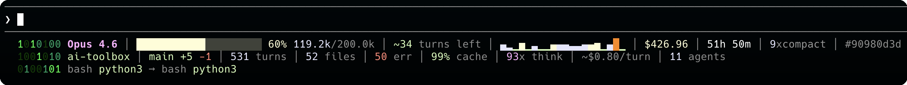
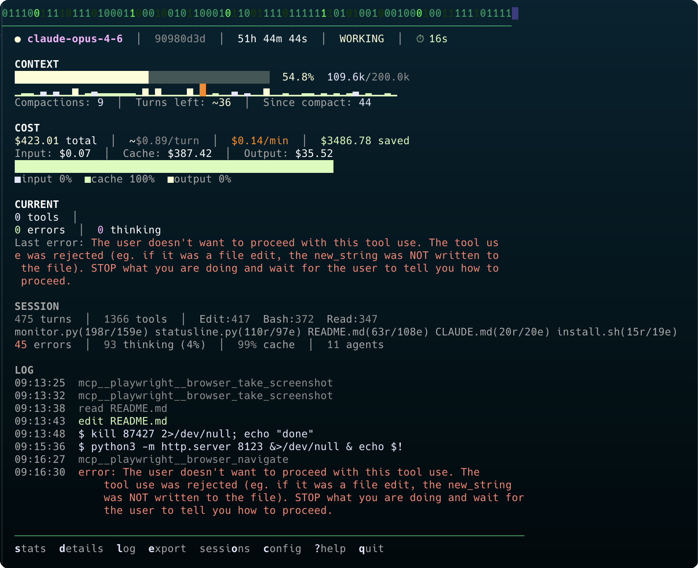
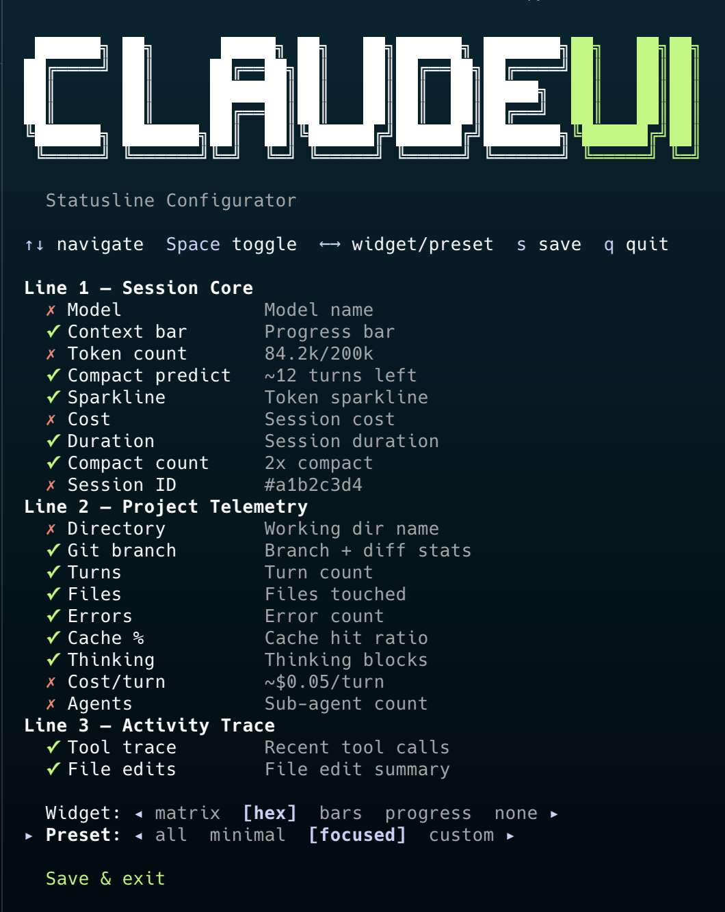
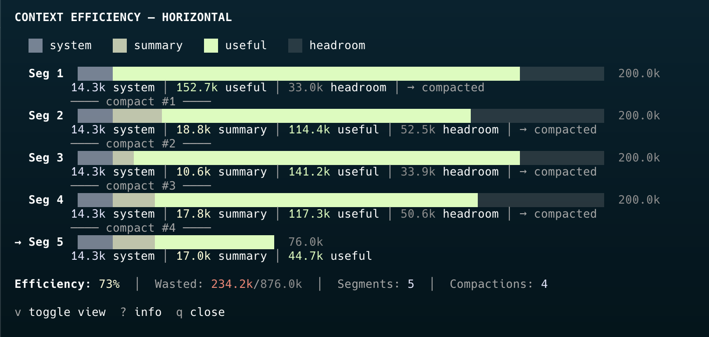

<p align="center">
  
</p>

[](https://github.com/slima4/claude-tui/releases)
[](https://github.com/slima4/claude-tui/stargazers)
[](https://github.com/slima4/claude-tui/commits/main)
[](https://github.com/slima4/claude-tui/blob/main/LICENSE)
[]()
[]()

Real-time dashboard, statusline, and analytics for Claude Code sessions.

**Website:** [slima4.github.io/claude-tui](https://slima4.github.io/claude-tui/)

**Statusline** — context, cost, sparkline, and live tool trace right inside Claude Code:



**Monitor** — full dashboard in a second terminal:



## Install

### macOS (Homebrew)

```bash
brew tap slima4/claude-tui
brew install claude-tui
claudetui setup       # configure statusline, hooks, and commands
```

### macOS / Linux (script)

```bash
curl -sSL https://raw.githubusercontent.com/slima4/claude-tui/main/install.sh | bash
```

Or clone and install locally:

```bash
git clone https://github.com/slima4/claude-tui.git && ./claude-tui/install.sh
```

### Windows (WSL)

ClaudeTUI requires a Unix-like environment. On Windows, use [WSL 2](https://learn.microsoft.com/en-us/windows/wsl/install):

```bash
# inside WSL terminal
curl -sSL https://raw.githubusercontent.com/slima4/claude-tui/main/install.sh | bash
```

After install:

```bash
claude                    # statusline + hooks work automatically
claudetui monitor         # live dashboard in a second terminal
claudetui chart           # context efficiency chart
claudetui stats           # post-session analytics
claudetui sniffer         # start API call interceptor proxy
claudetui sniff           # launch claude through sniffer
claudetui sessions list   # browse all sessions
claudetui mode compact    # switch to 1-line statusline
claudetui mode full       # switch to 3-line statusline
claudetui mode custom     # interactive configurator
# inside Claude Code:
/tui:session           # deep session report
/tui:cost              # cost breakdown
```

### Uninstall

```bash
claudetui uninstall       # clean settings, then uninstall
brew uninstall claude-tui
```

If you already ran `brew uninstall` first:

```bash
curl -sSL https://raw.githubusercontent.com/slima4/claude-tui/main/uninstall.sh | bash
```

### Customize Statusline

Toggle individual components, pick a widget, or apply a preset — all from an interactive TUI:

```bash
claudetui mode custom
```

<p align="center">
  
</p>

Or use CLI flags for non-interactive configuration:

```bash
claudetui mode custom -p focused          # apply preset
claudetui mode custom -w hex              # change widget
claudetui mode custom --hide model,cost   # hide specific components
claudetui mode custom -l                  # list current config
```

Three presets included: **all** (everything visible), **minimal** (essentials only), **focused** (hides noise like model, cost, session ID).

### Settings

Customize behavior via `~/.claude/claudeui.json` (hot-reloads, no restart needed):

```json
{
  "sparkline": {
    "mode": "tail",
    "merge_size": 3
  },
  "monitor": {
    "log_lines": 8
  }
}
```

| Setting | Values | Default | Description |
|---------|--------|---------|-------------|
| `sparkline.mode` | `"tail"`, `"merge"` | `"tail"` | `tail` shows last N turns; `merge` combines turns into buckets |
| `sparkline.merge_size` | number | `2` | Turns per bar in merge mode |
| `monitor.log_lines` | `0`–`50` | `8` | Number of log entries on monitor main screen (`0` = off) |

## Tools

### [claude-code-statusline](./claude-code-statusline/)

Real-time status bar for Claude Code with context sparkline, session cost, cache ratio, thinking count, live tool trace, and file edit tracking.

```
 0110100 Opus 4.6 │ ████████░░░░░░░░░░░░ 42% 65.5k/200.0k │ ~24 turns left │ ▁▂▃▅▆▇↓▁▃▅ │ $2.34 │ 12m │ 0x compact │ #a1b2c3d4
 1001011 ai-toolbox │ main +42 -17 │ 18 turns │ 5 files │ 0 err │ 82% cache │ 4x think │ ~$0.13/turn
 0110010 read statusline.py → edit statusline.py → bash python3 → edit README.md │ statusline.py×3 README.md×1
```

### [claude-code-session-stats](./claude-code-session-stats/)

Post-session analytics — cost breakdown, token usage sparkline, tool and skill usage charts, most active files, and compaction timeline.

```bash
python3 session-stats.py              # latest session
python3 session-stats.py --days 7 -s  # summary table for the week
```

```
  Session Summary (6 sessions)
  ──────────────────────────────────────────────────────────────────────────────────────────
  ID       Date         Duration     Cost  Turns  Compact Model
  ──────────────────────────────────────────────────────────────────────────────────────────
  a1b2c3d4 2026-03-08        45m $  2.31     34        0 opus 4 6
  e5f6a7b8 2026-03-07     2h 10m $ 12.47    156        1 sonnet 4 6
  c9d0e1f2 2026-03-04        18m $  0.52     12        0 opus 4 6
  13a4b5c6 2026-03-03     5h 22m $ 45.80    287        2 opus 4 6
  d7e8f9a0 2026-03-02     1h 05m $  8.14     89        0 sonnet 4 6
  b1c2d3e4 2026-03-01     3h 40m $ 28.55    198        1 opus 4 6
  ──────────────────────────────────────────────────────────────────────────────────────────
  Total                  13h 20m $ 97.79
```

### [claude-code-session-manager](./claude-code-session-manager/)

Browse, search, compare, resume, and export Claude Code sessions.

```bash
python3 session-manager.py list                       # recent sessions
python3 session-manager.py show abc123                 # session details
python3 session-manager.py diff abc123 def456          # compare two sessions
python3 session-manager.py resume abc123               # resume in Claude Code
python3 session-manager.py export abc123 > session.md  # export as markdown
```

```
  Recent Sessions
  ──────────────────────────────────────────────────────────────────────────────────────────────────────
  ID                   When Duration     Cost  Msgs   ⟳ Project              Branch            Model
  ──────────────────────────────────────────────────────────────────────────────────────────────────────
  a1b2c3d4      today 09:15      45m $  2.31    34   0 my-web-app           feature/auth      opus-4-6
  e5f6a7b8  yesterday 14:20    2h10m $ 12.47   156   1 my-web-app           main              sonnet-4-6
  c9d0e1f2     Mar 04 10:05      18m $  0.52    12   0 backend-app          fix/timeout       opus-4-6
  13a4b5c6     Mar 03 16:30    5h22m $ 45.80   287   2 my-web-app           feature/dashboard opus-4-6
  d7e8f9a0     Mar 02 09:00    1h05m $  8.14    89   0 docs-site            main              sonnet-4-6
  ───────────────────────────────────────────────────────────────────────────────────────────────
  Total cost: $69.24
```

```bash
python3 session-manager.py diff a1b2c3d4 13a4b5c6
```

```
  Session Comparison
  ────────────────────────────────────────────────────────────
                                Session A           Session B
  ────────────────────────────────────────────────────────────
  ID                             a1b2c3d4            13a4b5c6
  Project                      my-web-app          my-web-app
  Model                          opus-4-6            opus-4-6
  Branch                     feature/auth   feature/dashboard
  Date                         2026-03-08          2026-03-03
  Duration                           45m               5h 22m
  Messages                             34                 287
  Compactions                           0                   2
  Cost                              $2.31              $45.80
  ────────────────────────────────────────────────────────────
  Cost difference      +$43.49
```

### [claude-code-commands](./claude-code-commands/)

Custom slash commands for deep session analytics on demand. Install to `~/.claude/commands/tui/` and use:

```
/tui:session    Full session report — context, cost, tools, thinking
/tui:cost       Cost deep dive — spending breakdown, cache savings, projections
/tui:perf       Performance analysis — tool efficiency, errors, file heatmap
/tui:context    Context window analysis — growth curve, compaction timeline, predictions
```

### [claude-code-monitor](./claude-code-monitor/)

Live session dashboard for a separate terminal. Live duration, activity status, cost burn rate, tool trace, error details, auto-follow, and interactive hotkeys — all in the alternate screen buffer.



```bash
python3 claude-code-monitor/monitor.py           # auto-detect active session
python3 claude-code-monitor/monitor.py --list     # list recent sessions
claudetui chart                                   # context efficiency chart (standalone)
# While running: stats  details  log  chart  export  sessions  config  ?help  quit
```

### [claude-code-sniffer](./claude-code-sniffer/)

API call interceptor proxy. Captures every request and response between Claude Code and Anthropic's servers — including raw system prompts, HTTP headers, latency, and the hidden compaction API call not logged in transcripts.

```
Claude Code  ──plain HTTP──▶  Sniffer (localhost:7735)  ──HTTPS──▶  api.anthropic.com
                                    │
                                    ▼
                          ~/.claude/api-sniffer/*.jsonl
```

```bash
# Terminal 1: Start the sniffer
claudetui sniffer

# Terminal 2: Launch Claude Code through the sniffer
claudetui sniff
claudetui sniff --resume abc123
```

```
  #1   POST /v1/messages  opus-4-6  45.2k->1.5k  $0.120  2312ms  740KB/4.2KB  98%c  [Tt]
  #2   POST /v1/messages  opus-4-6  48.1k->0.8k  $0.094  1134ms  741KB/2.1KB  99%c  [TU]  Edit
  #3   POST /v1/messages  opus-4-6  12.3k->2.1k  $0.041  3412ms  42KB/6.8KB   95%c  [Tt]  compaction
  #4   POST /v1/messages  sonnet-4-6  14.3k->2.1k  $0.008  2341ms  42KB/6.8KB  [Tt]  +agent.1
```

### [claude-code-hooks](./claude-code-hooks/)

[Claude Code hooks](https://docs.anthropic.com/en/docs/claude-code/hooks) that provide automatic context about file activity, dependencies, and code churn — right inside Claude Code sessions.

**Session start** — file activity heatmap:

```
📊 File hotspots (last 14 days, 8 sessions):
  ███ src/config.ts (43e/12r)
  ▆▆▆ src/pages/dashboard/index.vue (39e/8r)
  ▅▅▅ src/locales/en.json (21e/15r)
  ▄▄▄ src/utils/constants.ts (19e/5r)
```

**After editing** — reverse dependency check:

```
⚠️ 4 file(s) depend on validation.ts:
  → app/composables/useAuth.ts
  → app/composables/useNotifications.ts
  → app/components/ui/ChangePasswordForm.vue
  → app/pages/reset-password.vue
Consider checking these files for compatibility.
```

**Before editing** — high churn warning:

```
🔥 High churn: config.ts has been edited 43 times across 5 sessions
in the last 14 days. Consider if this file needs refactoring rather
than more patches.
```

## License

MIT
